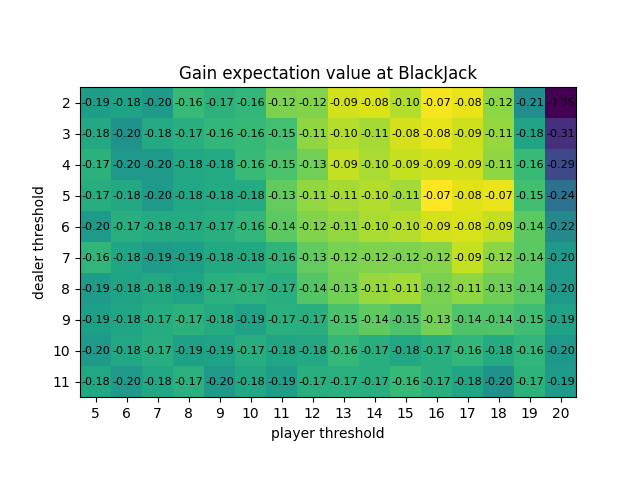

# MC_BlackJack

A Monte Carlo simulation of Blackjack with strategic analysis.

### What is Monte Carlo ?
[Monte Carlo](https://en.wikipedia.org/wiki/Monte_Carlo_method) is a method to approximate statistical expectation values from distributions that are hard compute directly. Instead we *sample* `N`elements from that distribution and compute expectation values on the sample. The error we make on the true expectation value is proportional to 1/sqrt(`N`), a result of the [Central Limit Theorem](https://en.wikipedia.org/wiki/Central_limit_theorem).

In this project the distribution is given by all possible games of Blackjack, that's astronomical. Instead we will sample `N`games and compute the average gain on that sample, which will be a very good approximation to the true average gain.

## How to install/run it

### Prerequisites
If you just want to play Blackjack :
- [Python3](https://www.python.org/downloads/)

If you also want to do some data analysis you will need pandas and matplotlib libraries, you can install them by running 
`pip3 install matplotlib pandas --break-system-packages`

1. Clone this repository 
`git clone https://github.com/avuign/MC_BlackJack.git
cd MC_BlackJack

2. You can play BlackJack on the terminal by running 
`python3 play_blackjack.py`
enjoy !

3. You can actually test different strategies to see what is more profitable in the long term. This is done with a statistical analysis using a Monte Carlo method. The code actually implements a very simple strategy where the player draws a card while his score is lower than `player_threshold`and the dealer's card is greater than `dealer_threshold`. You can run 
`python3 run_MC.py`
to run n=10000 games of Blackjack where the player uses this strategy for all possible values of `player_threshold` and `dealer_threshold`. The data is written on a `.csv`file that you can visualize by running 
`python3 plots.py`
to generate a heatmap of the gain expectation value (for an initial bet normalized to 1) as function of `player_threshold` and `dealer_threshold`.

## Results
Here's the heatmap generated with the simple strategy described above.

We can see that the gain expectation value is always negative, the house always has an edge when the player uses this strategy. The game is designed to be hard to beat ! However to minimize the house's edge one should focus on the values in the yellow squares. This makes sense, we should draw cards until we hit a high, but not too high, score, the optimum being around 16-18. Also do not draw if the dealer's card is below its threshold, he's likely to be forced into a two draws sequence and busts !

## What I learned
I did this as a mostly educational project and that was quite useful as I learned 

1. **Monte Carlo methods**: implementing MC simulations, understanding 
statistical error bars and their derivation from the Central Limit Theorem, 
and using sampling to approximate intractable expectation values.

2. **OOP design patterns**: building a clean class hierarchy (Card, Deck, 
Hand), using inheritance for the strategy system, and understanding when 
to use classes vs plain functions.

3. **Software engineering habits**: writing unit tests with `unittest`, 
organizing code across multiple files with clear separation of concerns, 
using git incrementally, and maintaining a living README.

4. **Data analysis**: generating structured data to CSV, manipulating it 
with pandas, and visualizing 2D functions as heatmaps with matplotlib.

## Possible future improvements

1. So far we only have a basic version of Blackjack where the player can only hit, double or stand. It would be nice to complement it by implementing split and surrender.

2. Implement more strategies, in particular the counting card strategy that should give an edge to the player.

3. Implement a better GUI for the actual blackjack game.
